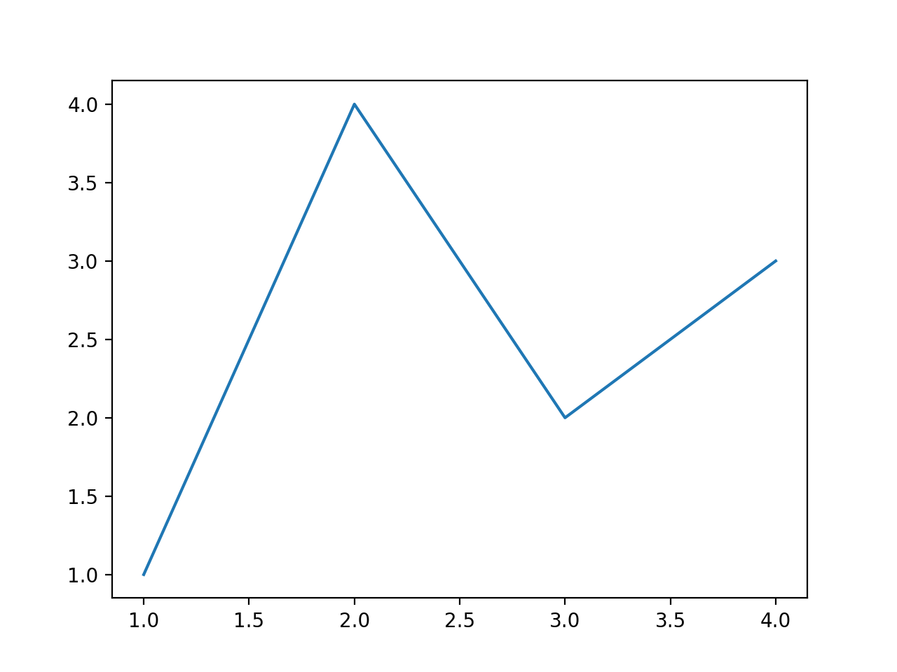
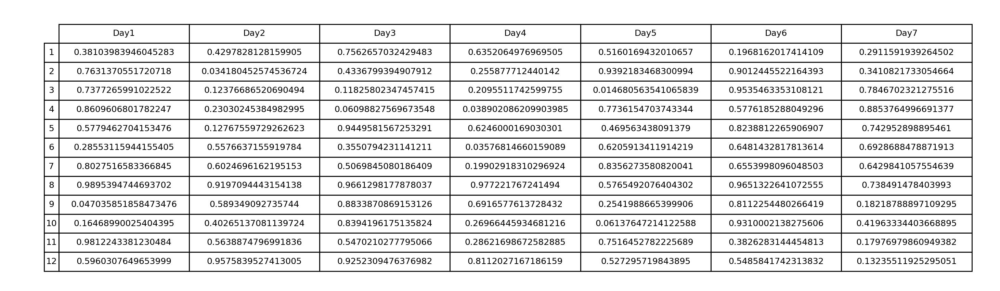
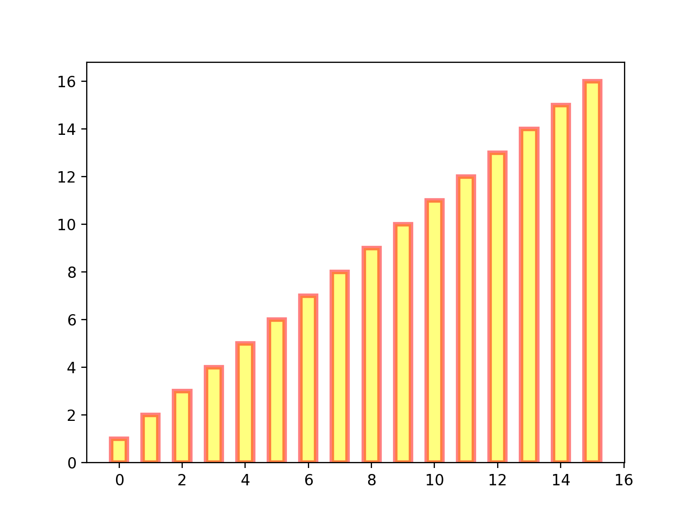
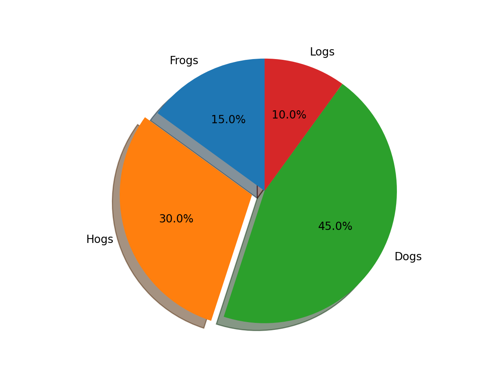

# 折线图

```python
import matplotlib.pyplot as plt

fig, ax = plt.subplots()  # 创建一个包含一个axes的figure
ax.plot([1, 2, 3, 4], [1, 4, 2, 3])  # 绘制图像，坐标点(1,1),(2,4),(3,2),(4,3)
plt.show()
```



# 表格

```python
import matplotlib.pyplot as plt
import numpy as np

# 列名
col = []
# 行名
row = []
for i in range(1, 8):
    col.append("Day" + str(i))

for i in range(1, 13):
    row.append(i)
# 表格里面的具体值
vals = np.random.rand(12, 7)
plt.figure(figsize=(20, 8))
tab = plt.table(cellText=vals,
                colLabels=col,
                rowLabels=row,
                loc='center',
                cellLoc='center',
                rowLoc='center')
tab.scale(1, 2)
plt.axis('off')
plt.show()
```



# 直方图


# 柱状图

```python
import matplotlib.pyplot as plt
import numpy as np

y = range(1,17)
plt.bar(np.arange(16), y, alpha=0.5, width=0.5, color='yellow', edgecolor='red', label='The First Bar', lw=3)

plt.show()
```



# 饼图

```python
import matplotlib.pyplot as plt 
labels = 'Frogs', 'Hogs', 'Dogs', 'Logs'
sizes = [15, 30, 45, 10] 
explode = (0, 0.1, 0, 0) 
fig1, ax1 = plt.subplots() 
ax1.pie(sizes, explode=explode, labels=labels, autopct='%1.1f%%', shadow=True, startangle=90) 
ax1.axis('equal') # Equal aspect ratio ensures that pie is drawn as a circle. 
plt.show()
```

