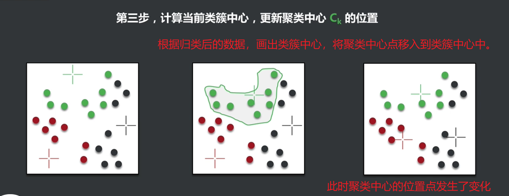

# 云计算、大数据与人工智能

## 云计算

`资源池化` `一切皆可服务化`

​	在使用实体设备时，如一台windows操作系统的电脑，因为企业是按照业务高峰期采购的物理资源，那么在大多数情况下，企业资源中内存、CPU、磁盘等硬件资产会处在一个较不饱和的状态（部分空闲）下。 那么在宏观上看，面向多台电脑时，如果可以做到集中管理，弹性资源分配恰如其分，那么性价比就比较高了。这时就有了虚拟化。在虚拟化演进的过程中，出现一直**按使用量付费**的模式、提供可用、便捷、按需的网络访问，进入**可配置的计算资源共享池**（包括网络、服务器、存储、应用软件、服务），这些资源被快速提供。**企业只需要投入很少**的管理工作，或与服务供应商进行很少的交互即可完成日常需求。

## 大数据

海量数据集+存储与计算+分析与应用，人工智能。

## 云计算和大数据

云计算提供存储和计算的基础设施，大数据是运行在其上的实际应用。

## 人工智能

人工智能,简而言之,就是会学习的计算机程序。分为弱人工智能、强人工智能、超人工智能。

1. 弱人工智能：在某一个领域达到或超过人类顶尖水平的计算机程序
2. 强人工智能: 在多个领域有强的学习能力达到或超过人类水平的计算机程序
3. 超人工智能：全方位碾压人类的计算机程序。

人工智能的项目特征：能体现智力的、规则比较简单的、有明确的胜负标准的。譬如棋牌类游戏。

# 机器学习

## 概览

1. 在不直接针对问题进行编程的情况下，赋予计算机学习能力的一个研究领域。-Arthur Samuel,1959
2. 一门人工智能的科学，主要研究对象是人工智能，特别是如何在经验学习中改善具体算法的性能。-Langley, 1996
3. 指机器通过统计学算法，对大量的历史数据进行学习从而生成经验模型,利用经验模型指导业务。
4. 对于某类任务T和性能度量P ,如果一个计算机程序在T上以P衡量的性能随着经验E而自我完善,那么我们称这个计算机程序在从经验E学习。

`数据挖掘`、`机器学习`、`模式识别`、`统计学习`、`计算机视觉`、`自然语言处理`、`语言识别`

# 数学基础

## 线性回归

# 常见算法 

算法:是利用计算机解决特定问题的处理步骤,是有限操作的集合

## 有监督学习算法

有监督学习( Supervised learning ) : 利用-组已知类别的样本来训练模型，使其达到性能要求。特点 为**输入数据(训练数据)均有一个明确的标识或结果(标签)**。即我们提供样例"教"计算机如何学习。

**分类算法**：离散的数据集；就是通过已有数据集(训练集)的学习,得到一个目标函数f (模型) , 把每个属性集x映射到目标属性y (类) ,且y必须是离散的(若y为连续的，则属于回归算法)。通过对已知类别训练集的分析,从中发现分类规则,以此预测新数据的类别。

按原理分类

- 基于统计的:如贝叶斯分类

- 基于规则的:如决策树算法

- 基于神经网络的:神经网络算法

- 基于距离的: KNN ( K最近邻)

常用评估指标:

- 精确率:预测结果与实际结果的比例

- 召回率:预测结果中某类结果的正确覆盖率

- F1-Score :统计量,综合评估分类模型,取值0-1之间

### 逻辑回归

Logistic regression，简称LR。逻辑回归其实是一个**分类**模型，最为突出的两点就是其**模型简单**和**模型的可解释性强**。**解决二分类的问题。**

应用：

1. 最初由Boyd 等人开发的创伤和损伤严重度评分（TRISS）被广泛用于预测受伤患者的死亡率，使用逻辑回归 基于观察到的患者特征（年龄，性别，体重指数,各种血液检查的结果等）分析预测发生特定疾病（例如糖尿病，冠心病）的风险。

#### 实战

### KNN  

K最近邻，K-Nearest Neighbour.

主要思路是，在散布的样本中，以目标点为圆心，指定一定距离为半径，划定一个圆，统计划定圆范围内的样本数据的特征，认为数量最多的特征为目标点特征，从而给出目标点的结果。

### 决策树算法（ID3）

迭代树3代

决策树的构建流程有5个步骤

1. 准备工作。明确自变量和因变量；确定信息度量的方式；确定终止方式。
2. 选择特征。得到待处理数据集，计算所有特征的信息度量，获得最佳分类特征。
3. 创建分支。根据选中的特征将当前记录分成不同分支，分支个数取决于算法。
4. 是否终止。判断是否满足终止条件。不满足则会回到step2 递归循环。
5. 生成结果。判断结果是否需要剪枝。输出最终结果。

*信息度量的方式有：熵、基尼系数。*

*分支终止条件有：纯度、记录条数、循环次数。*

#### 信息熵

香农提出的在信息论中描述混乱程度的度量，取值范围为0~1，值越大时，越混乱。
$$
Ent(D)=− \sum_{i=1}^{n}p_ilog_2^{p_i}
\\(注：p_i为概率值)
$$

譬如：有一堆苹果和梨共100个,随机拿出一个,拿出的是哪种?假设有三种样本：

- 50个苹果+ 50个梨子
- 0个苹果+ 100个梨子
- 80个苹果+ 20个梨子

那么计算信息熵时，按公式进行计算即可。场景1中苹果或梨的概率是：0.5,0.5；场景2中是：0,1；场景3中是：0.8,0.2
$$
E1 = -((50/100)*log_2^{50/100}+(50/100)*log_2^{50/100})\\
解得：E1 = -(0.5*-1+0.5*-1)=-(-1) = 1
$$

$$
E2 = -((100/100)*log_2^{100/100})=0\\
E2 = -(1*0) = 0
$$

$$
E3 = -((80/100)*log_2^{80/100}+(20/100)*log_2^{20/100})\\
E3 = -(0.8*-0.322 + 0.2*-2.322) = -(-0.2576-0.4644) = 0.722
$$

通过计算，我们认为场景1的信息熵最高，拿出一个水果来最难判断准确。而场景2的场景，拿出的水果必然是梨子。其信息的混乱程度为0。而82开的场景，混乱程度则是0.722。

#### 信息增益和特征选择

- 样本信息是增加确定性的，而非减少确定性的。
- 从一个状态到另一个状态信息的变化。
- 信息增益越大，对确定性贡献越大。

以下举例一个场景来描述信息增益和特征情况。存在如下样本数据：

| 名称   | 颜色 | 味道甜 | 是否水果 |
| ------ | ---- | ------ | -------- |
| 西红柿 | 红色 | 否     | 否       |
| 黄瓜   | 绿色 | 否     | 否       |
| 苹果   | 红色 | 是     | 是       |
| 提子   | 红色 | 是     | 是       |

我们观察数据来明确【是否水果】是因变量；而自变量有【颜色】和【味道甜】。

如果**不考虑任何特征，只从结果数据中统计估计**。则：

4个样本，2个是水果，2个不是水果。概率为1/2。所以它的熵是
$$
E1 = -((0.5)*log_2^{0.5}+(0.5)*log_2^{0.5})=1
$$
而选择【颜色】特征时，我们分析样本中存在

1. 红色共计3个，2个是水果，1个不是。 所以红色的概率有2/3，1/3
2. 绿色共计1个，都不是水果。所以绿色的概率为1，0
3. 红色个数占比：3/4；绿色占比1/4

所以，组合统计它的熵为：
$$
E_{red} = -((2/3)*log_2^{2/3}+(1/3)*log_2^{1/3}) = 0.918 \\
E_{green}= -((0/1)*log_2^{0/1}+(1/1)*log_2^{1/1}) =0\\
E_2= 3/4*E_{red} + 1/4*E_{green} = 0.689
$$
此时，通过增加了【颜色】特征，让**信息熵发生了变化**（此时从一个状态转变为了另一个状态了）。熵值从无特征的1变成了0.689，**增加了确定性**。

---

而选择【味道】特征时，分析样本中

1. 甜味有2个，全部为水果； 概率为1,0
2. 不甜的有2个，全部不是水果；概率为0,1
3. 样本中甜味的概率是2/4
4. 样本中不甜的概率是2/4

组合统计算得熵为：
$$
E_{sweet} = -((2/2)*log_2^{2/2}+(0/2)*log_2^{0/2}) = 0\\
E_{nsweet} =-((0/2)*log_2^{0/2}+(2/2)*log_2^{2/2}) = 0\\
E_3 = 2/4*E_{sweet} + 2/4*E_{nsweet} = 0
$$
计算发现，选择【味道】特征时，**得到的信息熵为0，该特征的信息混乱程度低**。

而信息增益计算为：

【颜色】特征： 1-0.6789=0.311

【味道】特征：1-0=1

**选择【味道】的信息增益是最高的。在统计分析中，由【味道】提供的信息对事实结果的判断更有意义。**

#### 构建决策树

1. 选择当前最佳特征（即信息增益最大的特征）
2. 按照取值产生分支
3. 是否满足终止条件，不满足则重新回到step1，此时证明所选特征虽为最佳，但无法指向终止结果。
4. 是否有待处理分支，如果有则回到step1。此时证明所选特征虽为最佳，但无法覆盖所有分支。
5. 生成决策树结果，处理结果。

对于如何现在最佳特征。这个就根据信息增益来。基础步骤有这么几个：

1. 计算整体的熵，即对于因变量的数据进行熵的计算。
2. 计算基于特征1、特征2...的熵
3. 计算获得特征1、特征2...的信息增益（整体的熵-特征N的熵）
4. 分析信息增益来得到当前最佳特征。

---

如下有一个实例进行详细说明。

| 标识 | 年龄   | 收入 | 单身 | 信用 | 是否购买电脑 |
| ---- | ------ | ---- | ---- | ---- | ------------ |
| 1    | 青少年 | 高   | 否   | 一般 | 否           |
| 2    | 青少年 | 高   | 否   | 良好 | 否           |
| 3    | 中年   | 高   | 否   | 一般 | 是           |
| 4    | 老年   | 中   | 否   | 一般 | 是           |
| 5    | 老年   | 低   | 是   | 一般 | 是           |
| 6    | 老年   | 低   | 是   | 良好 | 否           |
| 7    | 中年   | 低   | 是   | 良好 | 是           |
| 8    | 青少年 | 中   | 否   | 一般 | 否           |
| 9    | 青少年 | 低   | 是   | 一般 | 是           |
| 10   | 老年   | 中   | 是   | 一般 | 是           |
| 11   | 青少年 | 中   | 是   | 良好 | 是           |
| 12   | 中年   | 中   | 否   | 良好 | 是           |
| 13   | 中年   | 高   | 是   | 一般 | 是           |
| 14   | 老年   | 中   | 否   | 良好 | 否           |

分析业务目的和样本数据，我们希望可以判断顾客是否会购买电脑。

所以，因变量是【是否购买电脑】；自变量有【年龄、收入、单身、信用等级】

1. **选择第一级特征**

step1. 计算整体的熵。 样本数：14个；购买：9个；未购买：5个
$$
E_{all} = -(9/14*log_2^{9/14}+5/14*log_2^{5/14})=0.940286
$$
step2. 分析【年龄】的熵。

- 青年占比5/14，购买人员2个；购买/不购买概率：2/5，3/5
- 中年人占比4/14，购买人员4个；购买/不购买概率：4/4，0/4
- 老年人占比5/14，购买人员3个；购买/不购买概率：3/5，2/5

$$
E_{age} = 5/14*-(2/5*log_2^{2/5}+3/5*log_2^{3/5})+4/14*-(4/4*log_2^{4/4})+5/14*-(3/5*log_2^{3/5}+2/5*log_2^{2/5})=0.694
$$

step3. 分析【收入层次】的熵
$$
E_{income}=4/14*-(2/4*log_2^{2/4}+2/4*log_2^{2/4})+6/14*-(4/6*log_2^{4/6}+2/6*log_2^{2/6})+4/14*-(3/4*log_2^{3/4}+1/4*log_2^{1/4})=0.911
$$

step4. 分析【是否单身】的熵
$$
E_{single}=7/14*-(6/7*log_2^{6/7}+1/7*log_2^{1/7})+7/14*-(4/7*log_2^{4/7}+3/7*log_2^{3/7})=0.788
$$

step5. 分析【信用等级】的熵
$$
E_{credit}=8/14*-(2/8*log_2^{2/8}+6/8*log_2^{6/8})+6/14*-(3/6*log_2^{3/6}+3/6*log_2^{3/6})=0.892
$$

经过计算，我们归纳得到信息增益

| 特征 | 特征熵 | 信息增益 |
| ---- | ------ | -------- |
| 整体 | 0.940  | -        |
| 年龄 | 0.694  | 0.246    |
| 收入 | 0.911  | 0.029    |
| 单身 | 0.788  | 0.152    |
| 信用 | 0.892  | 0.048    |

第一级特征选择：最佳特征：【年龄】

第一层分支设计则如下：

---

2. **对第一特征分支【青少年】进行二级特征选择。**

如上，青少年下的样本数据为：共计5个样本。分别计算其整体熵、各特征熵。

| 标识 | 收入 | 单身 | 信用 | 是否购买电脑 |
| ---- | ---- | ---- | ---- | ------------ |
| 1    | 高   | 否   | 一般 | 否           |
| 2    | 高   | 否   | 良好 | 否           |
| 8    | 中   | 否   | 一般 | 否           |
| 9    | 低   | 是   | 一般 | 是           |
| 11   | 中   | 是   | 良好 | 是           |

- 收入高、中、低比例：2/5,2/5,1/5;购买/不购买概率是2/2，0；1/2,1/2；1/1,0

- 单身比例3/5,2/5; 购买/不购买概率是3/3,0; 2/2,0
- 信用比例3/5,2/5; 购买/不购买概率是1/3,2/3; 1/2,1/2

$$
E_{all(青少年)}=-(3/5*log_2^{3/5}+2/5*log_2^{2/5})=0.971
\\
E_{income(青少年)}=2/5*-(2/2*log_2^{2/2})+2/5*-(1/2*log_2^{1/2}+1/2*log_2^{1/2})+1/5*-(1/1*log_2^{1/1})=0.4
\\
E_{single(青少年)}=3/5*-(3/3*log_2^{3/3})+2/5*-(2/2*log_2^{2/2}) = 0
\\
E_{credit(青少年)}=3/5*-(1/3*log_2^{1/3}+2/3*log_2^{2/3})+2/5*-(1/2*log_2^{1/2}+1/2*log_2^{1/2}) = 0.951
$$

经过计算，我们归纳得到信息增益

| 特征         | 特征熵 | 信息增益 |
| ------------ | ------ | -------- |
| 整体(青少年) | 0.971  | -        |
| 收入         | 0.5    | 0.571    |
| 单身         | 0      | 0.971    |
| 信用         | 0.951  | 0.02     |

据上计算，第二分支【青少年】第二级特征选择【单身】。

按照【单身】是否划分分支后，我们看到划分后的数据集有唯一结果了。至此可终止。

如上，如果纯度不足以退出条件，则继续计算向下选择特征迭代。

3. **对第一特征分支【中年】进行二级特征选择。**

| 标识 | 收入 | 单身 | 信用 | 是否购买电脑 |
| ---- | ---- | ---- | ---- | ------------ |
| 3    | 高   | 否   | 一般 | 是           |
| 7    | 低   | 是   | 良好 | 是           |
| 12   | 中   | 否   | 良好 | 是           |
| 13   | 高   | 是   | 一般 | 是           |

由样本集可得，有唯一结果了。至此可终止。

4. **对第一特征分支【老年】进行二级特征选择**

| 标识 | 收入 | 单身 | 信用 | 是否购买电脑 |
| ---- | ---- | ---- | ---- | ------------ |
| 4    | 中   | 否   | 一般 | 是           |
| 5    | 低   | 是   | 一般 | 是           |
| 6    | 低   | 是   | 良好 | 否           |
| 10   | 中   | 是   | 一般 | 是           |
| 14   | 中   | 否   | 良好 | 否           |

$$
E_{all(老年)}=0.971
\\
E_{income(老年)}=0.951
\\
E_{single(老年)}= 0.951
\\
E_{credit(老年)}= 0
$$

| 特征       | 特征熵 | 信息增益 |
| ---------- | ------ | -------- |
| 整体(老年) | 0.971  | -        |
| 收入       | 0.951  | 0.02     |
| 单身       | 0.951  | 0.02     |
| 信用       | 0      | 0.971    |

据上计算，第二分支【老年】第二级特征选择【信用】。

按照【信用等级】划分分支后，我们看到划分后的数据集有唯一结果了。至此可终止。

---

至此，所有分支已经处理完。可以获得最后的决策树。

#### 问题

1. 信息度量不合理，倾向于选择取值多的字段
2. 输入类型单一：离散型。
3. 不做剪枝，容易过拟合。

#### 优化算法

C4.5算法、C50算法

#### 实战

---

## 无监督学习算法

无监督学习( Unsupervised learning ) :从**无标记的训练数据中推断结论**。其特点为输入数据(训练数据)不存在明确的标识或结果(标签)。

常见的无监督学习为**聚类** , 即发现隐藏的模式或者对数据进行分组。

即计算机根据我们提供的材料“自动”学习, 给定数据,寻找隐藏的结构或模式。

**聚类**:*就是将相似的事物聚集在一起 ,而将不相似的事物划分到不同的类别的过程。它是一种探索性的分析，不必事先给出一个分类的标准,聚类分析能够从样本数据出发,自动进行分类。聚类分析所使用方法的不同，常常会得到不同的结论。通常有：层次聚类、划分聚类、基于密度的聚类*

### K-Means

K均值聚类，属于划分聚类。其工作原理为根据初始化的聚类中心信息,计算每个样本到这些中心的距离,可以判断每个样本均归属于某个类簇,更新聚簇中心信息,重新计算每个样本到新的聚类中心的距离,重新划分样本到新的聚类中心对应的类中,重复进行,直到满足终止条件。**球状类簇数据友好型。**

1. 确定聚类个数（K个），确定聚类中心（K个），确定距离计算公式。
   聚类个数：观察法、枚举法、其他技术手段；

   聚类中心：随机

   距离计算公式：欧式距离等。

   

   

   定义三个随机中心点。

   

   

2. 计算每个点到聚类中心的距离，将每个点根据距离归类到聚类中心进行染色。
   

3. 计算当前类簇中心，将聚类中心的位置移入到对应的类簇中心范围内。更新聚类中心的位置。

4. 重复第二步，根据新的聚类中心点，重新计算各个点的距离后重新归类。

5. 重复第三步，根据最新的类簇，更新聚类中心的位置。然后再重复计算各个点的距离，重新归类。

6. 直到聚类中心位置不再变化，或循环次数达到预设阈值则结束。得到最终的聚类结果。

**业务伪码**：

选择 k 个点作为初始类簇中心

repeat

将每个样本点指派到最近的类簇中心,形成k个类簇

重新计算每个类簇的中心

until 类簇不发生变化 or 达到最大迭代次数

**K-Means 优缺点**

优点:

原理简单,容易理解,容易实现

聚类结果容易解释

聚类结果相对较好

缺点:

分类个数k需要事先指定,且指定的k值不同,聚类结果相差较大

初始的k个类簇中心对最终结果有影响,选择不同,结果可能会不同

能识别的类簇仅为球状,非球状的聚类效果很差

样本点较多时，计算量较大

对异常值敏感 ,对离散值需要特殊处理

### Apriori

关联规则算法。

Association Rule，关联规则是反映事物与事物间相互的依存关系和关联性。如果两个或多个事物间存在一定的关联关系,则其中一个事物能够通过其他事物预测到。

Apriori算法生成的关联规则包含三个指标：**支持度（Support）、置信度（Confidemce）、提升度（Lift）**，一般使用**支持度-置信度二个指标判断事务之间关联关系的强弱**，因此也被称为支持度-置信度框架（Support-Confidence Framework）

最经典的案例就是**购物篮分析**。通过分析顾客购物篮中不同商品之间的关系，来分析顾客的购买习惯，进而制定货物摆放规则或捆绑销售策略。如下存在样本数据。

| 流水号 | 购买商品 |
| ------ | -------- |
| A001   | A,C,D    |
| A002   | B,C,E    |
| A003   | A,B,C,E  |
| A004   | B,E      |

1. 首先划定最小支持度：50%， 最小置信度：50%
2. 确定**1项频繁项集**。样本总数4，A商品被购2次，B商品被购3次，C商品被购3次，D商品被购1次，E商品被购3次。根据划定的支持度和置信度，单项集合中去掉{D}。
   {A}:支持度50%；{B}:75%; {C}:75%; <del>{D}:25%;</del> {E}:75%;
3. 确定**2项频繁项集**。去掉集合{D}后，基于A、B、C、E组合出6种组合。故2项频繁项集为：
   {AC}:50%; {BC}:50%; {CE}:50%; {BE}:75%; <del>{AB}:25%;</del> <del>{AE}:25%</del>

4. 确定**3项频繁项集**。基于步骤3中，对4种组合组合为：{AC}、 {BC}、{CE}、 {BE}

   3项频繁项集有：

   <del>{AC}+{BC}={ABC}:25%;</del>

   <del>{AC}+{CE}={ACE}:25%;</del>

   <del>{AC}+{BE}={ABCE} 4项。</del>

   {BC}+{CE}={BC}+{BE}={CE}+{BE}={BCE}:50%;

   此时，频繁项集只有一个了。不需要继续找4项频繁项集了。

5. 确定关联规则，输出支持度和置信度数据
   根据步骤4中确认频繁项集是{BCE}，而集合{BCE}对应拆分出**非空子集**有：

   {B}、{C}、{E}、{BC}、{BE}、{CE}

   | 规则          | 置信度 | 支持度 |
   | ------------- | ------ | ------ |
   | IF(B)THEN(C)  | 66.70% | 75%    |
   | IF(B)THEN(E)  | 100%   | 75%    |
   | IF(B)THEN(CE) | 66.70% | 75%    |
   | IF(C)THEN(E)  | 66.70% | 75%    |
   | IF(C)THEN(BE) | 100%   | 75%    |
   | IF(E)THEN(BC) | 66.70% | 75%    |
   | IF(BC)THEN(E) | 100%   | 50%    |
   | IF(BE)THEN(C) | 66.70% | 75%    |
   | IF(CE)THEN(B) | 100%   | 50%    |

   如上计算为：
   $$
   Support(_{B=>C})=count(_B)/count(_{all})=3/4=75\%
   \\支持度可以直接看1项或2项频繁项集的占比来填写就行
   \\
   Confidence_{(B=>C)}=count(_{BC})/count(_B)=2/3=66.70\%
   \\
   ...
   \\
   Confidence_{(CE=>B)}=count(_{CEB})/count(_{CE})=2/2=100\%
   \\
   IF(B)THEN(C)的置信度=BC出现次数/B出现次数=2次/3次=66.70\%
   \\
   IF(CE)THEN(B)的置信度=CEB出现次数/CE出现次数=2次/2次=100\%
   $$
   

## 半监督学习算法

半监督学习:训练数据有部分被标识,部分没有被标识,这种模型首先需要学习数据的内在结构，以便合理的组织数据来进行预测。旨在避免数据和资源的浪费，解决监督学习模型泛化能力不强、无监督学习的模型不精确等问题。

- 半监督分类 : 在无类标签的样例的帮助下训练有类标签的样本,弥补有类标签的样本不足的缺陷

- 半监督回归 :在无输出的输入的帮助下训练有输出的输入,获得性能更好的回归器

- 半监督聚类 : 在有类标签的样本的信息帮助下获得比只用无类标签的样例得到的结果更好的簇

- 半监督降维 :在有类标签的样本的信息帮助下找到高维输入数据的低维结构,同时保持原始高维数据和成对约束的结构不变

## 集成学习算法

针对同一数据集,训练多种学习器,来解决同一问题。

Bagging：

- 有放回抽样构建多个子集

- 训练多个分类器

- 最终结果由各分类器结果投票得出

- 实现非常简单

Boosting：

- 重复使用一类学习器来修改训练集

- 每次训练后根据结果调整样本的权重

- 每个学习器加权后的线性组合即为最终结果

Stacking：

- 由两级组成，第一级为初级学习器，第二级为高级学习器

- 第一级学习器的输出作为第二级学习器的输入

## 深度学习算法

深度学习的概念源于人工神经网络的研究。含多隐层的多层感知器就是一种深度学习结构。**深度学习通过组合低层特征形成更加抽象的高层表示属性类别或特征,以发现数据的分布式特征表示**。属于机器学习研究中的一个新的领域,其动机在于建立、模拟人脑进行分析学习的神经网络,它模仿人脑的机制来解释数据,例如图像,声音和文本。

常见算法有：

1. 受限玻尔兹曼机（RBM）
2. 深度信念网络（DBN）
3. 卷积网络
4. 栈式自编码

## 增强学习算法

增强学习要解决的问题是:一个能感知环境的自治agent，通过学习, 选择能达到其目标的最优动作。本质就是解决"决策(decision making)"问题,即学会自动进行决策。比如控制移动机器人、在工厂中学习最优操作工序、学习棋类对弈等

常见增强学习算法:

1. Q-Learning
2. 时间差学习 Temporal difference learning

## 迁移学习

迁移学习是要把已学训练好的模型参数迁移到新的模型来帮助新模型训练数据集。初衷是节省人工标注样本的时间,让模型可以通过已有的标记数据向未标记数据迁移。换言之,就是运用已有的知识来学习新的知识,核心是找到已有知识和新知识之间的相似性。
